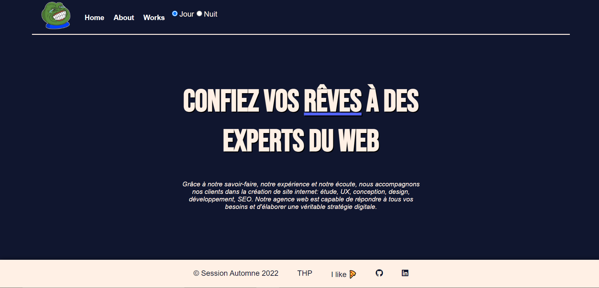

## (Petit) exercice React

 
- Install
 
:$ npm install
 
:$ npm run dev
 
 
- Mission : Application d'agence web avec des routes dynamiques en react  

 L'application est faite en React configuré avec Vite, utilisation de Scss, booster au redbull

    

 Ciao 	&#129302;

